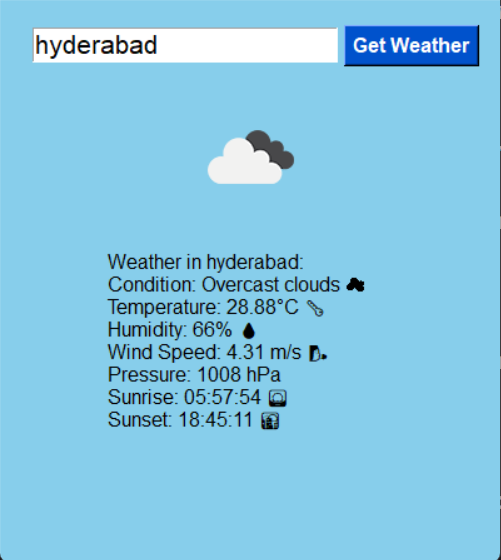
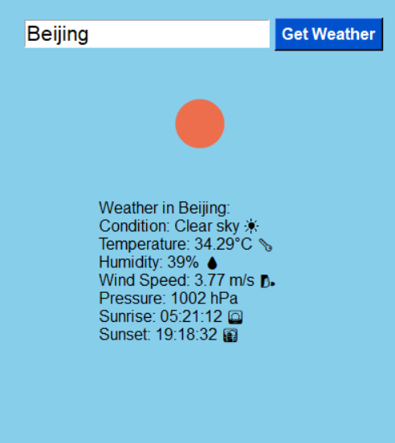
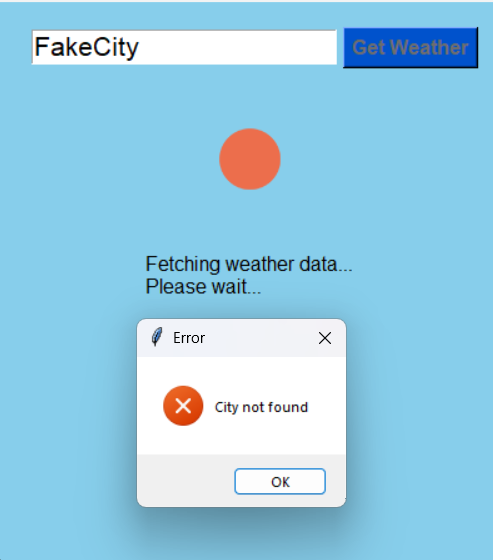

# CloudPeek

CloudPeek is a simple, friendly weather app for your desktop. Just type in any city name, and CloudPeek gives you live weather updates—temperature, humidity, wind speed, pressure, sunrise, sunset, and clear icons and emojis for the current conditions.

It remembers your last searched city so you can check your local (or favorite) weather in seconds. CloudPeek runs on Windows as a standalone app (no Python needed) or from source if you want to customize it.
## Features

🌤️ Fast weather lookup for any city

😊 Emojis and icons make info clear at a glance

🌅 Displays temperature, humidity, wind, pressure, sunrise, and sunset

💾 Remembers last city searched

💻 Modern, cheerful GUI

🚀 Easy to use as a standalone .exe (no Python required)

## Screenshots

## How to Run
### Option 1 — Standalone App for Windows (Recommended)

If you want to use CloudPeek without installing Python:

Locate (or download) the CloudPeek.exe file from the dist folder.

**Double-click CloudPeek.exe to launch CloudPeek.**

_No installation needed! Works out of the box on Windows._

## Future Ideas

Add 5-day weather forecasts

Customizable color themes and units (°F/°C)

Support for multiple languages

Animated weather icons

## License

__This project is licensed under the MIT License.__

This means you can use, modify, and share CloudPeek however you want—just include the license!

## Credits

 Made by __Tanush Reddy__ for Hack Club Summer of Making and anyone who wants weather at a glance. Powered by OpenWeatherMap.